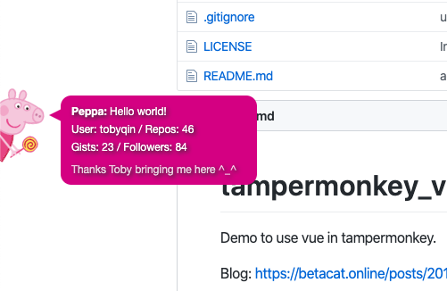

# tampermonkey_vue

Demo to use vue in tampermonkey.

Blog: <https://betacat.online/posts/2019-02-24/tampermonkey-user-script-with-vuejs/>

## How to 

1. Install tampermonkey to your browser.
2. Open this link in your browser: <https://github.com/tobyqin/tampermonkey_vue/raw/master/github-info/github-info.user.js>
3. Refresh this page (or any github page), you will see a peppa like this.

